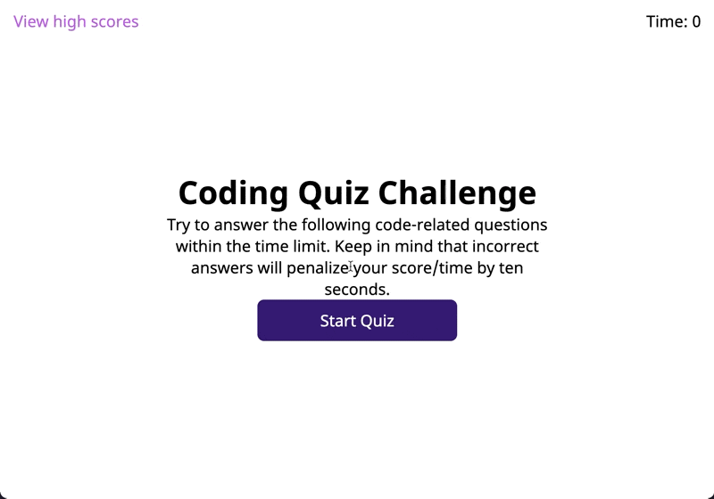

# congenial-guacamole


## Description

Want to keep your Javascript skills up to date and challenge your friends at the same time? This quiz awards you points for getting the quiz done as quickly as possible. Take care in your answers! The wrong ones reduce your score.

Try it out [here at https://lwjones.github.io/congenial-guacamole/](https://lwjones.github.io/congenial-guacamole/)



## Purpose

The main purpose of this application is to get the basics down of how to interact with the DOM in vanilla Javascript. Understanding the basis of Javascript and how it works is paramount to understanding how other libraries implement the same functionality.

The largest issue for this application is how to load one question after another. Had an issue with a bug where all the quiz question would be skipped and all the choices would pool together. These were resolved by remembering two things: clearing the content within elements before repopulating them and stepping through each question.

When using event listeners on an element, a function cannot be directly called without a "not a function" complaint from the console. Instead, you can add the methods you would like to call to the anonymous function of the event listener.

```javascript
// produces an error
choicePool.addEventListener("click", checkAnswer);
// Also does not work when trying to invoke checkAnswer

// works when creating an anonymous function
choicePool.addEventListener("click", function(event) {
    checkAnswer(event, questionIdx);
    // ...
});
```

This also helped in ensuring that each question would be stepped through after the user makes a choice, preventing the error when everything loaded all at once.

Moreover using blank divs created more issues than convinience. What would have helped was creating dives in javascript and using/removing them. Working in this way would make things more clear and easier to work with.
